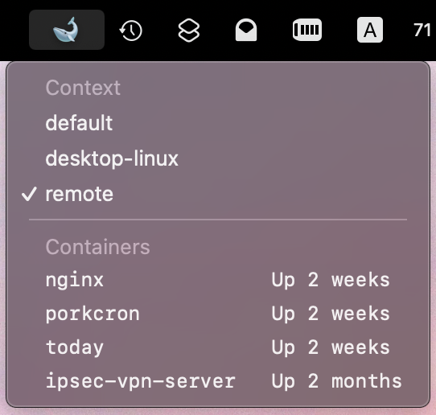
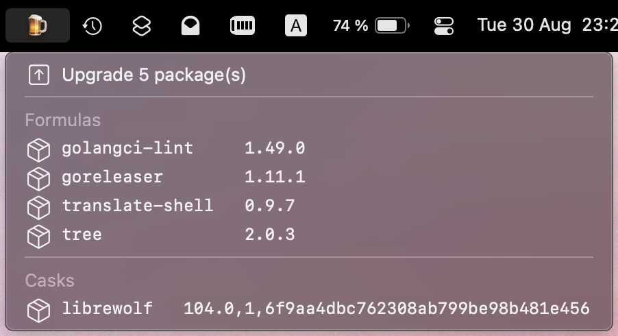
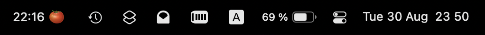

# SwiftBar plugins

[](https://github.com/amcintosh/swiftbar-plugins/actions/workflows/run-tests.yml)

A collection of plugins for [SwiftBar](https://github.com/swiftbar/SwiftBar) (also compatible with [xbar](https://github.com/matryer/xbar)).

Docker container, Homebrew, Pomodoro, and plugin Python library originally
from [https://github.com/tmzane/swiftbar-plugins](https://github.com/tmzane/swiftbar-plugins) (dead).

## 📦 Install

Python 3.11+

1. [Install SwiftBar](https://github.com/swiftbar/SwiftBar#how-to-get-swiftbar) (if not already)

2. Clone this repository

   ```shell
   git clone https://github.com/amcintosh/swiftbar-plugins
   ```

3. Create a symlink to the selected plugin in your [plugin folder](https://github.com/swiftbar/SwiftBar#plugin-folder).

   ```shell
   ln -s /path/to/repo/plugin_name.py $SWIFTBAR_PLUGINS_PATH/plugin_name.py
   ```

## 🔌 Plugins

* [AI token usage](#ai-token-usage)
* [Docker containers](#docker-containers)
* [Homebrew upgrades](#homebrew-upgrades)
* [HSX market calendar](#hsx-market-calendar)
* [PagerDuty schedule](#pagerduty-schedule)
* [Pomodoro timer](#pomodoro-timer)
* [Tomcat run check](#tomcat-run-check)

Most plugins support configuration via top-level constants, such as `PLUGIN_ICON`.
Feel free to modify them for your needs.

### AI token usage

Show your monthly AI token spend as a percentage of your budget.
Entries are grouped by client and model.

Uses [`tokscale`](https://github.com/tmzane/tokscale) CLI tool (via npx).

### Docker containers



Switch between Docker contexts and list running containers.
Click to open logs in a separate terminal tab.

### Homebrew upgrades



List outdated Homebrew packages.
Click to upgrade the selected package.

### HSX market calendar

Show upcoming [Hollywood Stock Exchange](https://www.hsx.com) events.

Requires [hsx-cli](https://github.com/amcintosh/hsx-cli).
Configure `HSX_CLI` to point to your installation.

### PagerDuty schedule

Show your current PagerDuty on-call status across all schedule and display a 🔴 icon when you are on-call, and 📟 otherwise.

Requires [PagerDuty CLI](https://github.com/amcintosh/pager-duty-cli) and a `pager_duty_token` in `.secrets.ini`:

```ini
[secrets]
pager_duty_token = your_token_here
```

Configure `PAGER_DUTY_CLI` to point to your CLI installation.

### Pomodoro timer



A [pomodoro timer](https://en.wikipedia.org/wiki/Pomodoro_Technique) in your menu bar.
Click to start the countdown.

### Tomcat run check

Show a 🐈 icon in the menu bar when a local Tomcat (Catalina) process is running.
The menu bar item is hidden when Tomcat is not running.
